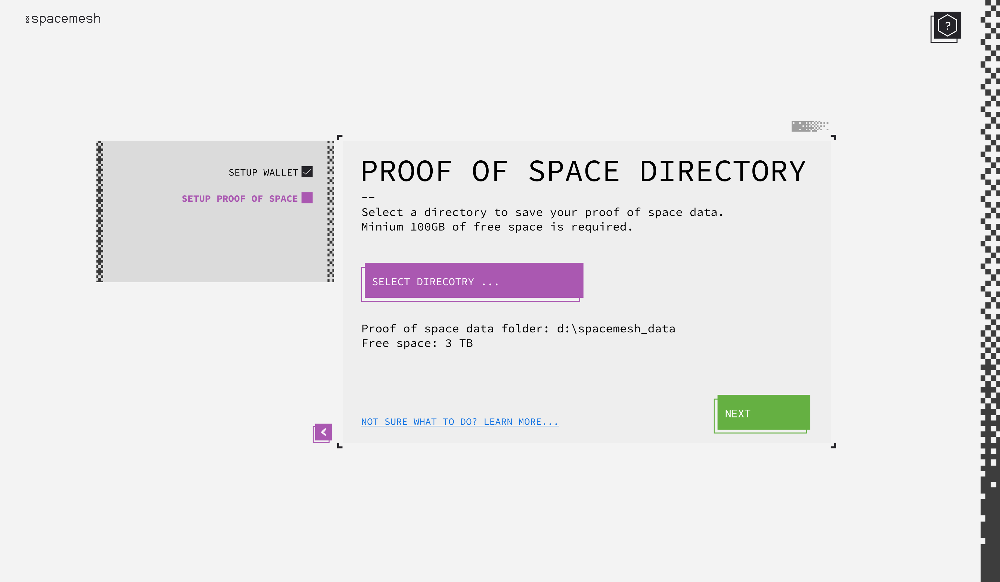
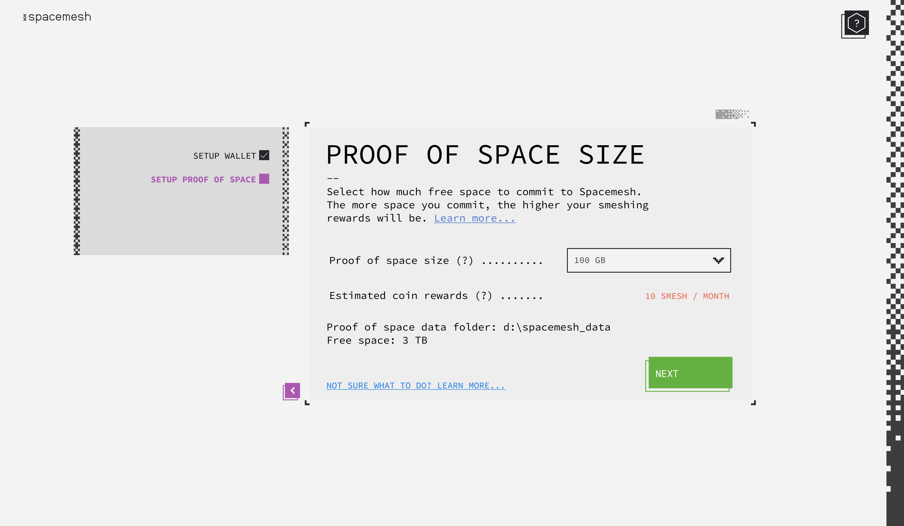
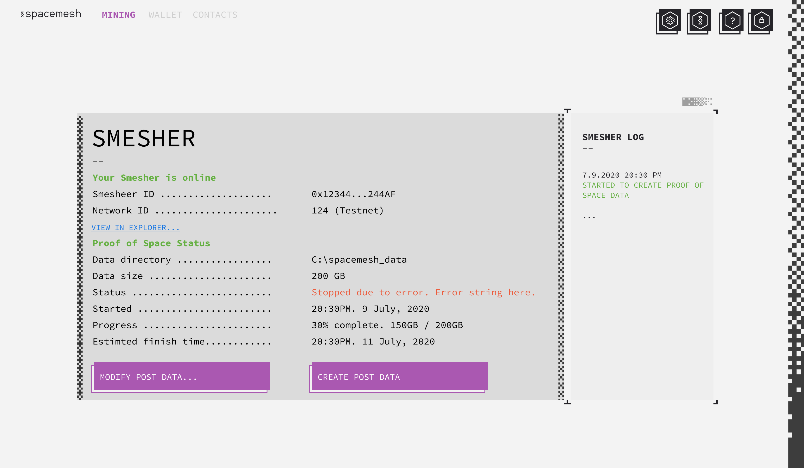
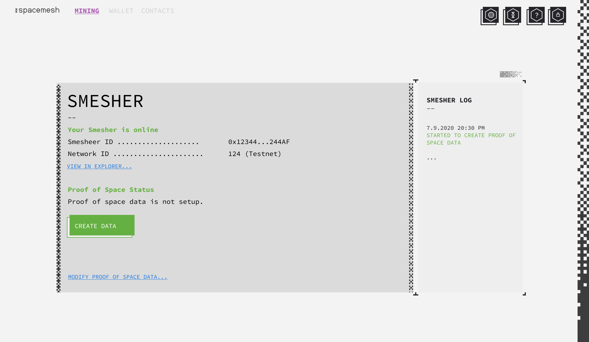
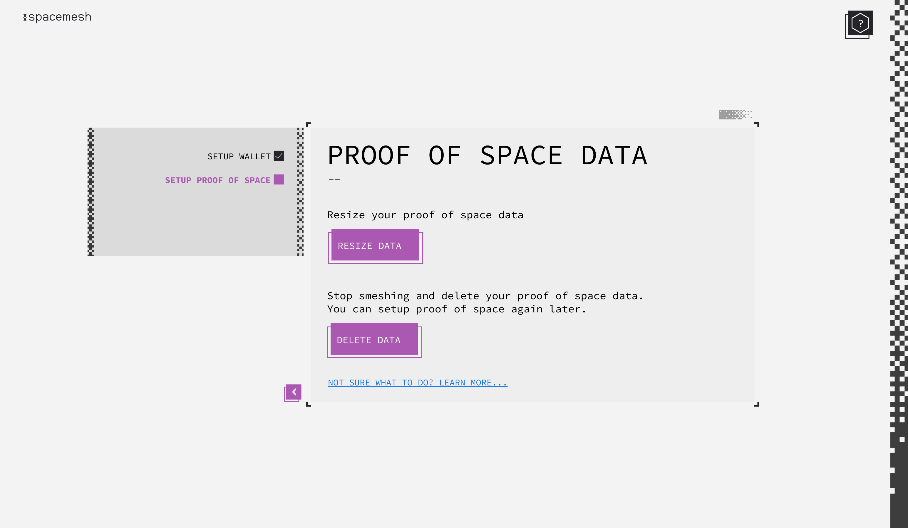
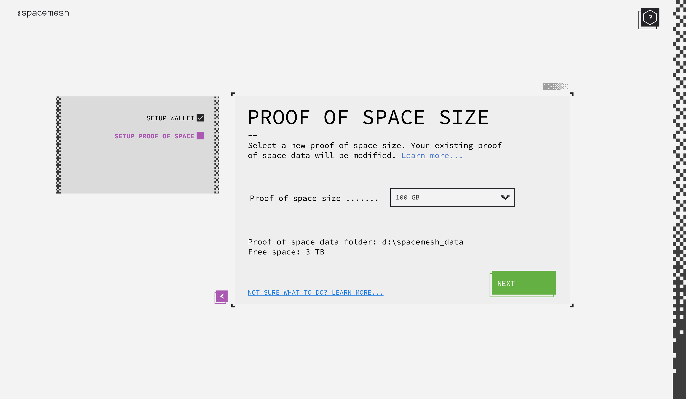

# Proof of Space Data Smapp Flows
This spec describes the following flows in the Spacemesh app:

1. Set up proof of space in the App using a system gpu gpu as part of the smesher setup flow.
2. Track setup progress and any errors.
3. Delete proof of space data and stop smeshing.
4. Resize proof of space data.

## Proof of Space Data Setup Wizard

Wizard flow starts when setting a new smesher in the app's first user experience flow or when user clicks a button in Smesher to setup smeshing.

### Step 1 - Data Directory

> Note in future releases, we'll enable selection of multiple paths, potentially on different system volumes.

- User specifies a directory on a volume.
- App should check that the path has sufficient free space for the min size data. e.g. 100GB free if the network min proof of space data is 100GB.
- App should display an error if user tries to specify a path with insufficient space. Otherwise, app should display the available free space on that volume and the path that was selected.
- `Next` should be disabled until a valid path was selected.

### Step 2 - Data Size

- App creates a drop down with all the available data sizes based on the min data size (a network param), the available space on the directory's volume and the max data size for a single proof of space data (a network param).
- App displays the dropdown so user can easily select any legal value. It is okay even if drop down have hundreds of entries - desktop users know how to scroll large menus with the mouse wheel / trackpad.
- Enable user to type requested storage size. e.g. `3 TB` into the drop-down. Technically this is should be an editable combo-box.
- The App should present to the user the estimated coin rewards per month based on the user size selection and the the number of active smeshers in the most recently finished epoch.

> The Smesher API service should provide an end-point for the estimated reward/month for the min proof of space data unit.

- By default, the app should select the min data size so user can just review and click on next if he doesn't wish to change data size.

### Step 3 - Data Processor

- The App displays to the user a list of available processors and compute engines to create the data. For example, when the system has 1 Nvidia Geforce RTX 2070 GPU which supports Cuda and Vulkan compute engine, the drop-down will list two options: `Nvidia Geforce RTX 2070 (CUDA)` and `Nvidia Geforce RTX 2070 (Vulkan)`.
- For each available processor and engine, the app should display the estimated work time to create the data.
- When no processor if available on the system - the app should display a note about this instead of the drop-down with link to read about supported processors in the guide.

> We might include an option to use the main CPU as the processor in future releases but for this release we only support compatible gpu processors.

- App displays a check-box for pausing data creation when the computer is used. When checked, the data creation process will only use the processor after a 5 minute period of no user interaction with the computer. When unchecked, creation should not consider user idleness and work at the topmost available speed.

### Step 4 - Review & Create Data

- The App should display the data creation information specified by the user in previous steps.
- User reviews the data and clicks `Create Data` to start creating it.
- User can go back to review his input in previous steps.
- User should be able to cancel the setup (not displayed in the mock) via a `Cancel Setup` button.
- Clicking `Create Data` should start the data creation process and display the main Smesher screen (below).

---

## Smesher Screen with Proof of Space Data Info and Status

- The Smesher main screen provides information and data creation status.
- The mock includes all the status and info data that should be presented to the user.
- When data creation is in progress, user can pause data creation by clicking on the `Pause Creating Data` button.
- If the user paused, he may resume the creation at any later time and the pause button should change to 'Resume Creating Data'.
- User can choose to modify the post data at any time - while the data is being created or when it was alredy created by clicking the `Modify Post Data Button`. Clicking it causes the App to display the Modify Data screen (see below).

---

## Smesher Screen with Proof of Space Data Error

- When there was an error creating the data. The App displays the error to the user and user can click on `Create Data` to start the data creation process again.
- User can also choose to modify the data size by clicking on the `Modify Data` button.

---

## Smesher Screen when Data Is Not Setup

- This is the contents of the smesher screen when proof of space setup never started by the user. e.g. He canceled out of the data creation wizard.  
- Clicking on `Create Data` starts the Post Data Setup Wizard (above).

---

## Modify Proof of Space Data Screen

- User clicks on `Resize Data` to resize it.
- If data was even partially creator, user can click the `Delete Data` to delete it. When doing so, the App should display a confirmation dialog box, explaining to the user that deleting the data means stops smeshing and getting rewards and getting the user confirmation.
- If data was not created, app should not display this section on this screen.

## Resize Proof of Space Data Screen

- Similar interaction to initial proof of space size setup. User selects a new size and clicks `next`.
- The App should continue the interaction from that screen to the next ones. e.g. processor selection...
