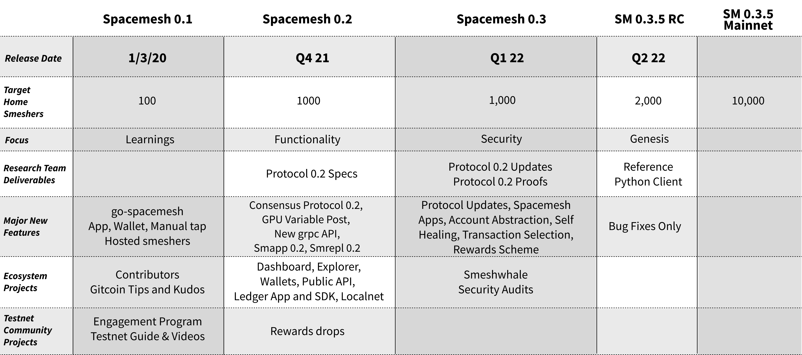

# Spacemesh Project Product Plan and Roadmap

## TL;DR

> Note that spacemesh is under active dynamic development and milestones dates and features may change.

## Overview
Our short-term high-level product plan is to build [Spacemesh 0.1](spacemesh01.md), release an open public testnet, follow-up with two major open testnet releases `Spacemesh 0.2` and `Spacemesh 0.3`. We are aiming to have a mainnet release candidate we call `Spacemesh 0.3.5` in 2021 and launch a mainnet genesis based on the quality of the release candidate.

Our long-term high-level product plan is to implement, test and roll-out additional capabilities and features to the platform in subsequent incremental releases until the full platform is released as `Spacemesh 1.0` with support to all the main use cases outlined here.

Incremental product releases, starting with `Spacemesh 0.1` will be deployed to testnets first for testing and to the `Spacemesh Mainnet` once they reach production quality level and have been security audited.

0.x releases are going to include bug fixes, updates and additional features for testing on the public testnet prior to mainnet launch. The mainnet will be launched once we are comfortable with the quality, security and performance of a 0.x release.

---

# Spacemesh Roadmap

## TL;DR: 2020 and 2021 Roadmap

---
# Completed milestones

## Q4 2017
- [x] Go-spacemesh App scaffolding.
- [x] Core p2p protocol.
- [x] Core data structures.
- [x] Initial project specs.
- [x] Support for accounts.
- [x] Node gRPC and Cloud API for Gateway.

## Q1 2018
- [x] Core p2p and node capabilities.

## Milestone 1  - Q2 2018
- [x] Published [White Paper 1](https://spacemesh.io/whitepaper1/) with initial protocols tech specs.

## Milestone 2 - Q3 2019
- [x] Publish [Spacemesh Protocol 1.0](https://spacemesh.io/spacemesh-protocol-v1-0/).
- [x] Launch local Testnet for developers with a CLI wallet and CLI full node. See [Local Testnet](https://testnet.spacemesh.io/#/local).

## Milestone 3 - Q4 2019
- [x] Full node and proof of elapsed time service code complete.
- [x] Simple proof of space protocol finalized and e-print published. Presented at crypto 2019.
- [x] Running closed Testnet with 1,500 nodes across several world regions, bootstrap nodes and a PoET service.
- [x] SVM - A Wasm-based smart contracts runtime alpha code-complete.
- [x] Proof of space GPU setup library for Windows and Linux code-complete.
- [x] Spacemesh Desktop App 0.1 for Windows, OS X and Linux Code Complete and in testing.

## Milestone 4 - Spacemesh 0.1 Public Testnet Launch - Q1 2020

### Spacemesh 0.1 Release Highlights

The main use case case of `Spacemesh 0.1` is to support [Smesh](spacemesh_coin.md) cryptocurrency transactions between any two parties and to award `Smesh` to people who run full Spacemesh full p2p nodes on their PCs.

The Spacemesh full node implements the [Spacemesh consensus protocol 1.0](https://spacemesh.io/spacemesh-protocol-v1-0/) and other protocols to support this use case.

The main goal of this release is to provide an MVP of a permissionless and trustless Internet money that is secure, decentralized and scalable without using POW or PoStake mechanisms.

### Focus: LEARNINGS
- [x] Launch open Testnet with the [Spacemesh 0.1 product](https://testnet.spacemesh.io) for all three major desktop platforms.
- [x] Build and run full node from source (go-spacemesh + CLI wallet) instead of using the App and join testnet or run a local devnet.
- [x] Automated community testnet tap.

----

## Milestone 5 - TweedleDev - Spacemesh 0.2 Public Devnet - Q3 2021

> Shipped September 5th, 2021.

[TweedleDev Guide](https://testnet.spacemesh.io/#/devnet)

### Focus: Spacemesh 0.2 consensus protocol

#### Full Node
- [x] Spacemesh grpc API
- [x] Spacemesh protocol update - Sync, Tortoise and Hare protocols.
- [x] User-defined PoST data size and GPU-based PoST setup.
- [x] Supported macOS, Windows 10 and Linux platform

#### Smrepl
- [x] Spacemesh grpc API client
- [x] User-defined PoST data size and GPU-based PoST setup.
- [x] Supported macOS, Windows 10 and Linux platform

#### Web Services
- [x] Dashboard and Explorer web apps.
- [x] A public Spacemesh grpc API web service.
- [x] Network discovery service.

----

# Current and future milestones

## Milestone 6 - Spacemesh 0.2 Public Testnet - Q3 2021

### Focus: Functionality and Spacemesh App 0.2

#### Full Node
- [ ] Smeshers rewards protocol including Hare and ATX rewards. <meter value="0.6"/>
- [ ] Self healing protocol. <meter value="0.7"/>

#### Platform Projects
- [ ] Testnet rewards drop program. <meter value="0.8"/>

#### Spacemesh App 0.2
- [x] Dark mode.
- [x] Dashboard screen.
- [x] Use discovery service for configuration.
- [x] New main screens and ui cleanup.
- [ ] Use Spacemesh grpc API. <meter value="0.8"/>
- [ ] User-defined PoST data size and GPU-based setup. <meter value="0.8"/>

#### SMRepl
- [ ] Full compatibility with Spacemesh App wallet files

----

## Milestone 7 - Spacemesh 0.3 Public Testnet - Q4 2021

### Focus: SECURITY
- [ ] Perform comprehensive security audits and execute a bug bounty program for Spacemesh protocol, full nodes and testnet.
- [ ] Fix all critical issues found in audits and in Spacemesh 0.2.
- [ ] Release updated protocol docs site for 0.3 protocol and main components.
- [ ] Implement account abstraction model, new transactions format and signature schemes.
- [ ] Vault mesh app
- [ ] Vault apps and multi-sig transactions.
- [ ] New transactions selection algorithm. <meter value="0.7"/>

#### Spacemesh App
- [ ] Vaults and multi-sig transactions.
- [ ] Support new transaction format and signature scheme.
- [ ] Sign transactions with Ledger hardware device. <meter value="0.2"/>
- [ ] Wallet-only Mode. <meter value="0.8"/>

#### SMRepl
- [ ] Vaults and multi-sig transactions.
- [ ] Support new transaction format and signature scheme.
- [ ] Sign transactions with Ledger hardware device. <meter value="0.2"/>

#### Platform Projects
- [ ] Spacemesh Ledger App and SDK <meter value="0.8"/>

---

## Milestone 8 - Spacemesh 0.3.5 Mainnet Release Candidate on Public Testnet - Q4 2021

### Focus: GENESIS
- [ ] Launch release candidate for final testing on testnet before mainnet genesis.

> *Caveat*: we are only going to launch a mainnet for the Spacemesh Coin cryptocurrency once we have obtained a high-degree of confidence in the security of our platform. This means both full published theoretical proofs for all of the protocols and the security of the Spacemesh node implementation.

---

## Milestone 9 - Spacemesh 1.0 - TBD

### Full Node
1. [ ] Validators role in full node and consensus on global state.
1. [ ] Tokens and stable coins via SVM smart contacts.
1. [ ] Payment channels and a payment network for Spacemesh coin and tokens.

### Ecosystem Projects
1. [ ] 3D network explorer.
1. [ ] Update Spacemesh and SMRepl apps to support all new features.
----
