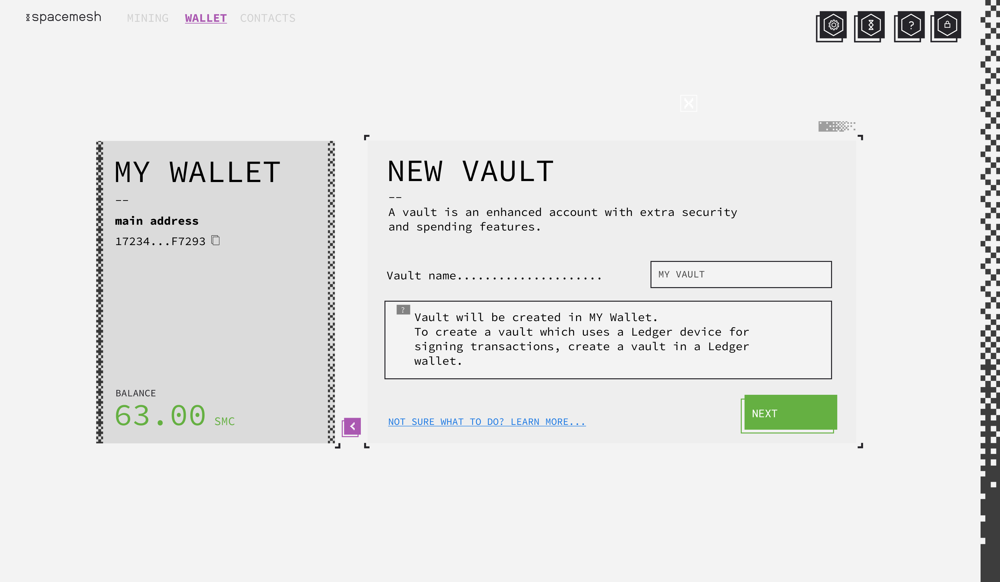
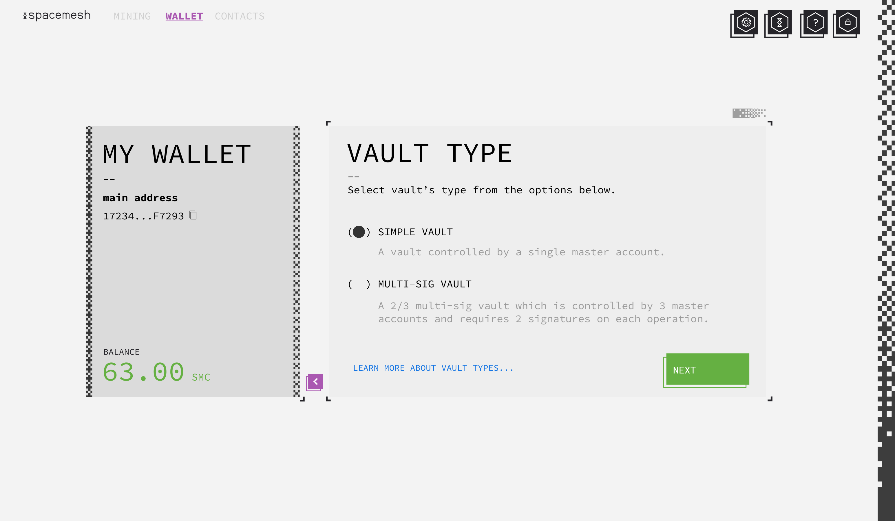
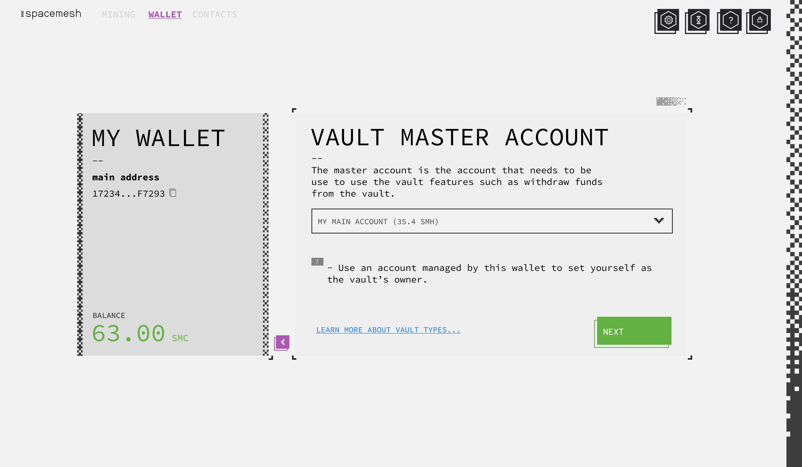
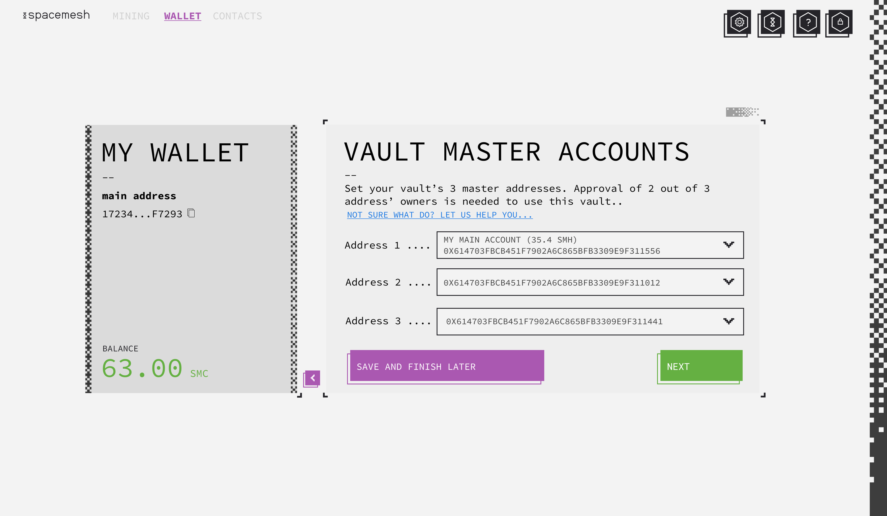
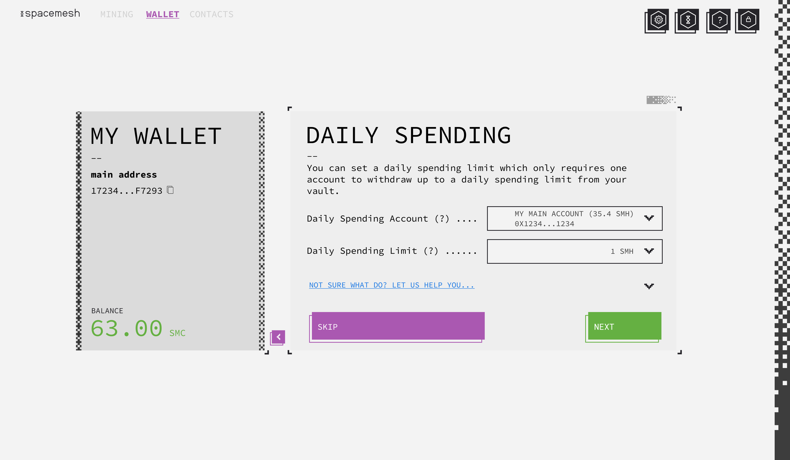
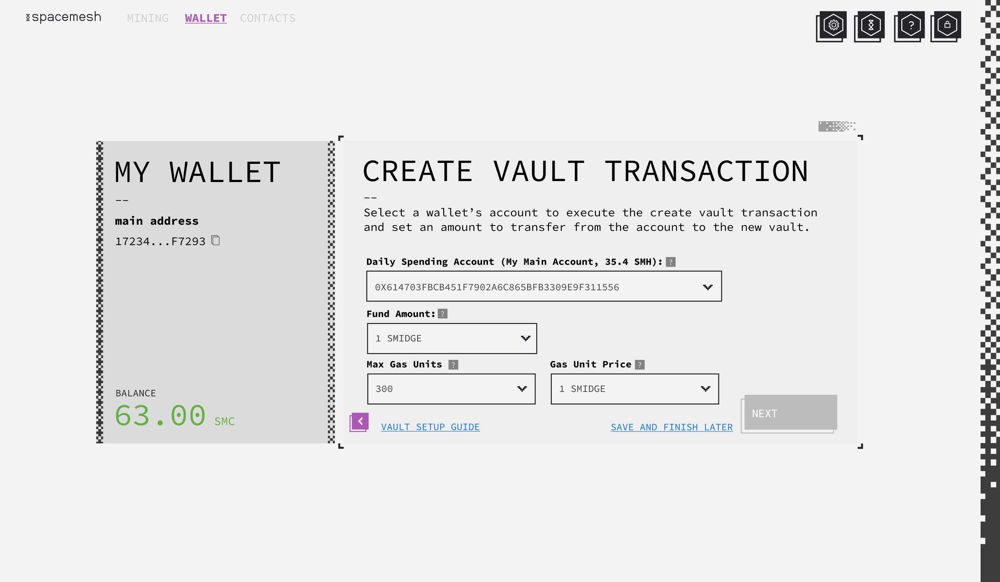
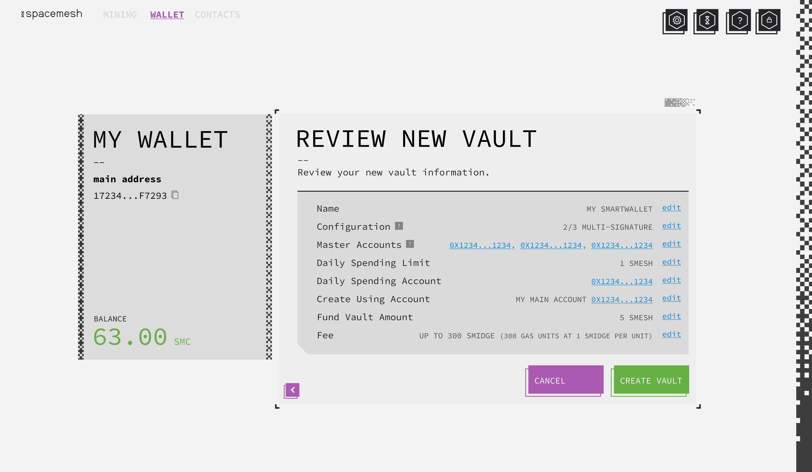
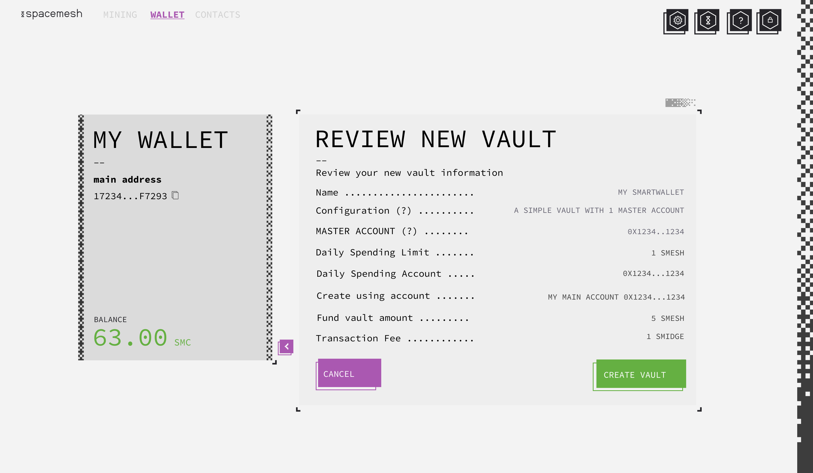
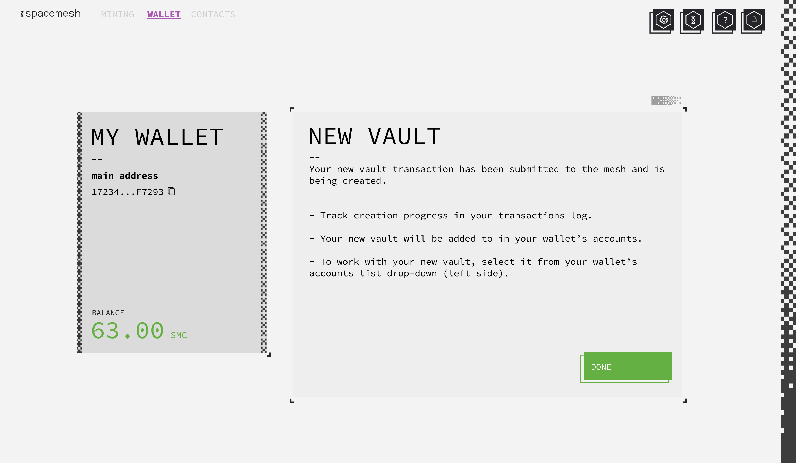
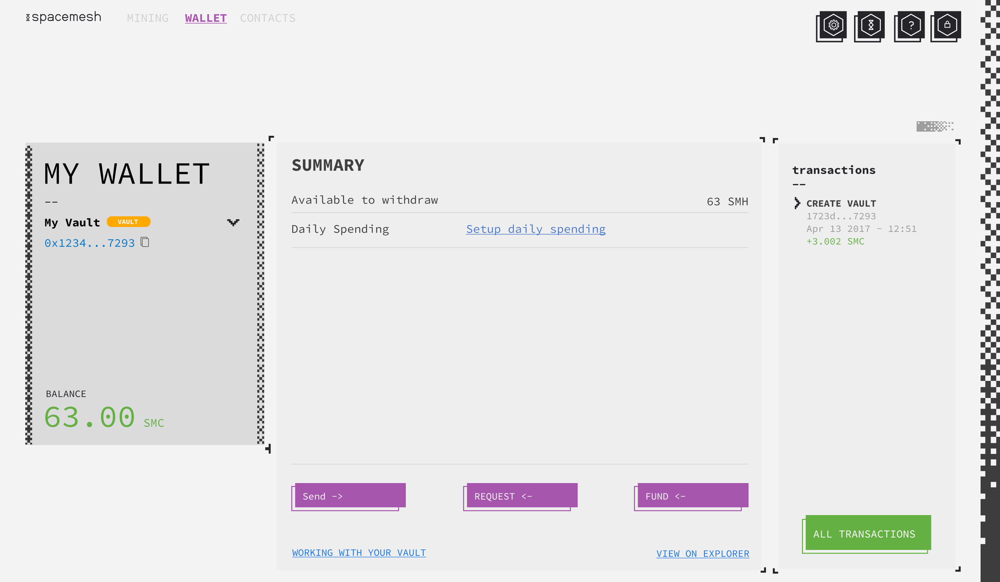

# Vaults in Smapp

This document describes the main flows of creating and working with vaults in smapp.

Vaults is the only app which users can create and use in the first version of the Spacemesh mainnet.

Vaults is an advanced feature which showcase the power of the Spacemesh VM and smart contracts. It is designed to provide enhance security and capabilities for working with coins on the Spacemesh platform use cases.

Vaults also work with Ledger hardware wallet.

## Definitions

### Vault
A Spacemesh vault smart contract instance which is deployed from the vault's code template. The code template will be automatically deployed at genesis time of the Spacemesh network.

### A Simple Vault
A vault with one master account is fully controlled by the master account owner and he doesn't need authorization from anyone else to perform any operation such as withdraw, set daily spending limit and set daily spending account.

### A Multi Sig Vault
A vault configured with 3 master accounts. Operations are initiated by one master account owner and require approval of additional one master account owner on the following operations: withdraw, set daily spending limit and set daily spending account. A 3 master accounts vaults is similar to the concept of 2 out of 3 multi-sig wallet.

### Genesis Deployed Vaults
These vaults are deployed at genesis time to a Spacemesh network from data in the network's genesis config file. These vaults provide vesting capabilities.

### User Created Vaults
These vaults are created by users using a create transaction. Vesting features are not supported for user-created vaults. A new vault is created via a special transaction called `spawn-app` transaction. The user which creates and submits this transaction specifies his new vault's configuration and funding amount using the flow described below in smapp or in any other Spacemesh wallet app.

## Creating a Vault In Smapp - User Interactions

From a user-perspective a vault is a special account that is added to an existing wallet. The wallet can be a hot-wallet or a ledger hardware device wallet. When a vault is added to a hot-wallet, it is created by a wallet's hot address and operations on the vault in the basic use-case also use the wallet's hot addresses. When a vault is added to a ledger wallet, it is created using a hardware-wallet secured address and transaction and operations in the simple use case are performed by the user using a hardware wallet address.

### Step 1 - Set Vault Name

1. User starts the new vault interaction by clicking new vault from his wallet's addresses drop down or from the wallet's settings.

2. App displays the new vault screen.

3. User names the vault and clicks next.

### Step 2 - Set Vault Type

1. User selects `simple vault` or `multi-sig vault` and clicks `next`.

A simple vault is a vault which is controlled by one master account. A multi-sig vault is a vault which requires 2 signatures from 3 master accounts.

### Step 3 - Set Simple Vault Master Account

- User's goal to specify the vault's master account.
- The dropdown should display all the accounts which were created in the wallet as well as an entry for each of the wallet's contacts.
- User should be able to paste any address. This allows users to create a vault which is controlled by any address - not just addresses in his wallet.

### Step 3 - Set Multi-sig Vault Master Accounts

- User's goal to specify the vault's 3 master accounts.
- The drop-down should include all the wallet's accounts as well as contacts accounts.
- User should be able to paste an address into each of the 3 addresses fields.
- User should be able to save the vault information and continue the setup at a later time. This is needed as he may need to gather addresses from other uses that he wishes to setup the vault together with.
- User clicks `Next` when 3 accounts have been set.

### Step 4 - Set Daily Spending

- User can set a daily spending limit and account and should be able to skip this optional step.
- User should be able to select any of his wallet's account or a contact account as the daily spending account. He should also be able to paste any address to set it as the daily spending account.
- User should be able to set the daily spending limit in coin units.
- User clicks `Next` after providing an address and a daily spending limit.

### Step 5 - Prepare New Vault Transaction

- User should be able to provide the vault creation transaction required information.
- User selects one of the accounts with non-zero balance in his wallet.
- User should be able to set an optional funding amount to be transferred to the vault from the transaction's account.
- User should be able to set the transaction fee.
- User clicks 'Review' when he provided the 3 required data items.

### Step 6 - Review Simple Vault Setup

- User reviews the new vault configuration, can go back and edit any configuration item, cancel the new vault creation process or click `Create Vault` to create it.
- When the user clicks on `Create Vault` the app should prepare, sign and submit the spawn-app transaction to the network.
- When the transaction is set from an account that is on a ledger device, the app should prompts the user to connect his device and sign the transaction on it.

### Step 6 - Review Multi Sig Vault Setup

### Step 7 - New Vault Confirmation

This screen is displayed when the new vault transaction has been successfully submitted to the network.

-----

## Working with Vaults

### Accessing a Vault
- Vaults are accessed in Smapp in a similar way to how an account is accessed.
- A vault always belongs to a specific smapp wallet and user views a vault by making it the current wallet's account in Smapp.
- To access a vault in a different wallet, user is expected to switch smapp to access that wallet and select to make the vault the active account.

### Working with Vaults

- In the mock above, a simple vault called `My Vault` is displayed in `My Wallet`.
- A visual indicator next to the vault's name indicates that this is a vault account.
- Vault total balance is displayed on the bottom-left under `balance` - similar to the balance of a standard address.
- User can set up or modify daily spending limit or daily spending account by clicking on `Setup daily spending` button.
- On the right side, a list of recent vault transactions is displayed and user can click on `All Transactions` to view the vault's transactions. See vault transactions below.
- In the main area, 3 main buttons are displayed with the main simple vault commands.
- A vault can be funded by sending coin via a simple coin transaction from another account to the vault. Clicking on 'Fund' should display a transaction screen with the receiver address set to the vault's app instance account address. User should be able to select any account in the current wallet with a non-zero balance to prepare a fund transaction.
- Clicking on 'Request' should display a screen which includes instructions on how to request anyone to send money to the vault via a simple coin transaction.
- Clicking on 'Send' should trigger the `Send Coins from Vault` interaction.

### Sending Coin from a Vault
There are 2 main cases to consider here:
- Case 1: Daily spending is not setup for the vault.
- Case 2: Daily spending is setup in the vault.

For case 1 - when user clicks on 'Send' the app should display a new transaction screen to enable the user to send coin using the vault's master account(s).

In case of a simple vault, the screen is as follows:

- TODO: Add send from vault screen for single master account.

If the vault is a Multi Sig Vault, the send screen should look as follows:

- TODO: Add send from vault screen for 2/3 multisig vault and explain the interaction across vault owners.

For case 2, the app should display the following dialog where the user selects which account he wants to use to send coin from the vault - via the spending account or via the master account(s):

- TODO: show mock here - select which account to use to send....

If the user selected to use the daily spending account then display this transaction screen:

- TODO: Daily Spend Transaction Screen.

If the user selected to use the master account then continue the interaction described in case 1 above.

### Viewing Vault's Transactions

- TODO: add screen shot here.

The transaction screen for a vault should display the following transactions:
1. The spwan-app transaction which created the vault (unless it is a genesis deployed vault)
2. Every call-app transaction sent to the vault.
3. Every fund transaction from another account which sent coin to the vault.

- Transactions should be clearly label to clarify their type.
- Transaction details for spawn-app should display the construction arguments - for each argument - name, and value.
- Transaction details for a call-app transaction should display the arguments names and values.

### Setting Spending Limit Amount - Simple Vault

### Setting Spending Limit Amount - Multi Sig Vault

### Setting Spending Limit Account - Simple Vault

### Setting Spending Limit Account - Multi Sig Vault

### Adding an Existing Vault

### Hiding a Vault
