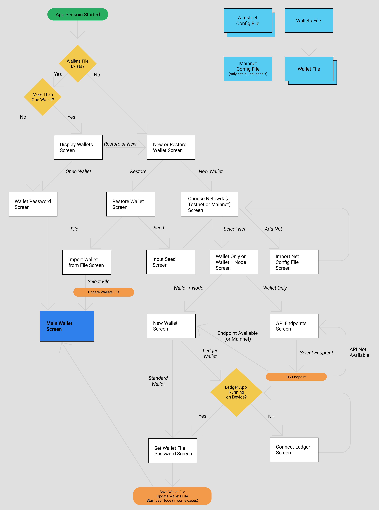

# Smapp Wallets User Journey

## Entities

### Testnet Config File
A full node config file describing a Spacemesh Testnet. Required to connect to a testnet. Currently 1 config file embedded in Smapp. We'd like to enable user to use Smapp to connect to different Testnets without having to use a new version of Smapp. The config file specifies a network unique id. To connect to a Testnet, user needs to obtain its config file and save it in a designated location for Smapp to be able to identify it on startup.

### Mainnet Config File
A minimal config file which includes mainnet network id. It is used to create wallets for use on mainnet pre-genesis. Before genesis, a mainnet full config file will be provided and users need to download it and use it to connect to the Mainnet. The full config file will replace the minimal one.

### Wallet File
A wallet data file. Includes wallet and contacts information. Used by both hot wallets and ledger wallets. Private data in this file is always encrypted with the user's provided password. Each wallet must have a data file that specifies it. So user will have a wallet file for each wallet it created in smapp.

### Wallets File
A simple data file which contains a list of user's wallet data files and the location of the data file for each such wallet. This enables users to access any wallet in Smapp. Smapp can only work with one wallet at a time.
If this file is getting corrupted or deleted then user will just need to restore wallets (from paper backup or backup file) to be able to work with them. Path to a restored wallet's data file is added to the Wallets file.

## The Journey

