# Smart Wallets in Smapp
Smart Wallets is the only app which users can create in the first version of the Spacemesh mainnet. This document describes the main flows of creating and working with smart wallets in smapp. Smart wallets is an advanced feature which showcase the power of Spacemesh VM and smart contracts. It is designed for enhance security and capabilities for working with coins on the Spacemesh platform.

## Creating a new Smart Wallet
A new smart wallet is created via a special transaction. User specifies the required wallet configuration and funding amount using the flow described below.

### Step 1 - Enter Wallet Info
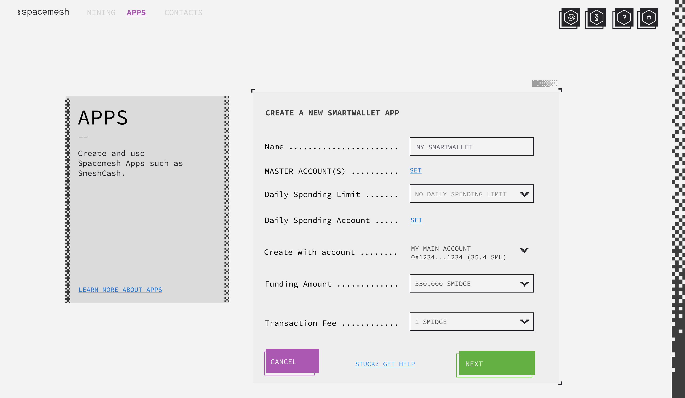

- User enters the new smart wallet info.
- User clicks on SET to specify 1 or 3 master accounts.
- One of the master accounts should be owned by the user.
- The master account may be on a hardware wallet generated key pair connected via usb to smapp or a standard smapp hot wallet.
- User can optionally set a daily spending account and daily spending limit.
- User sets the funding amount, the account to create the smart wallet with. This should be one of his owned accounts.
- Smart wallet nickname (up to 20 utf chars) is stored on mesh with the new wallet's app instance.

### Step 2 - Set One Master Account
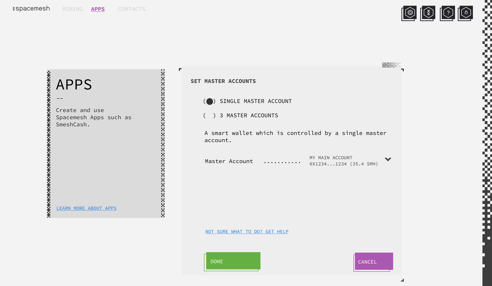

- User sets one of the accounts he owns as the new smart wallet's master account.
- User can switch to set up a 3 master keys wallet (2/3 multi-sig).
- The drop-down should give access to all created user accounts available in the current wallet.
- It should also have a command to create a new account. In this case, the smart wallet master account will be a newly generated account in the current wallet (a new derived account).

### Step 2 - ALT: Set Three Master Accounts
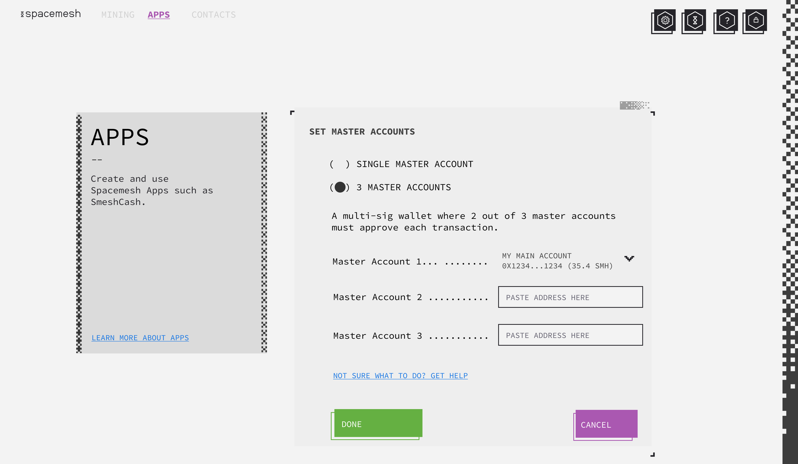

- User sets his owned account as one master account and need to get from the 2 other smart wallet owners the public address they would like to use for the wallet. This can be any valid Spacemesh account.

### Step 3 - Set Spending Account
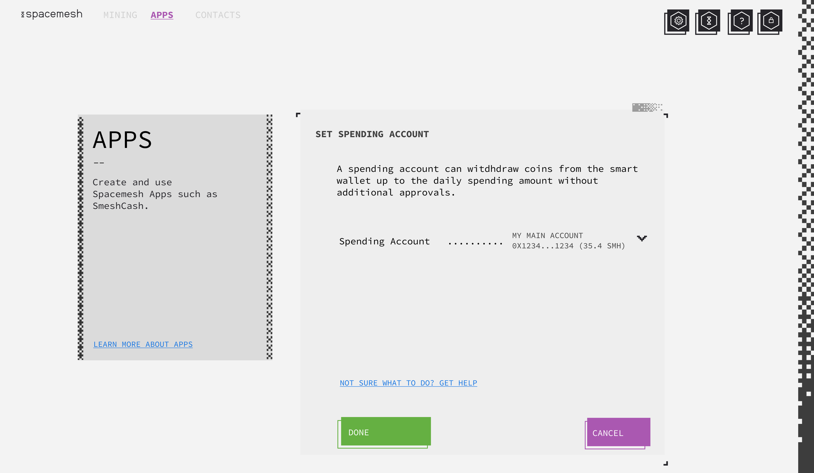

- This is an optional feature. User can set a daily spending account. This can be any of his existing wallet accounts or a newly generated account created for the purpose of spending.

### Step 4 - Confirm New App
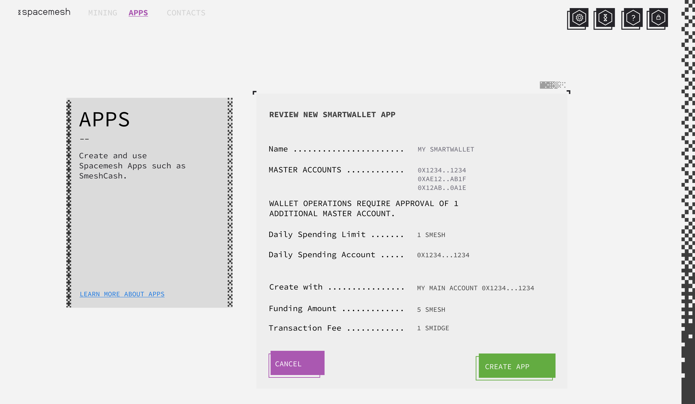

- User reviews all the information he entered and clicks on `create app` when done.

### New App Confirmation
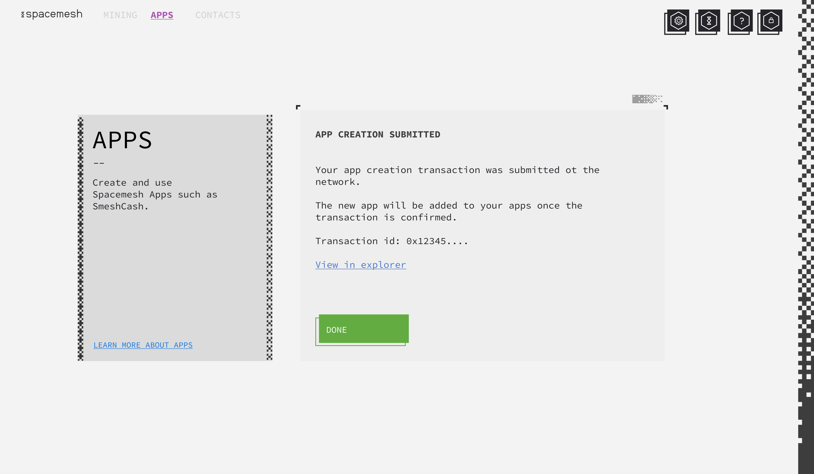

- User is notified that his new smart wallet app creation transaction has been submitted to the Spacemesh network. He will get notified via smapp when the wallet has been created and is raady to use.

### New App Created
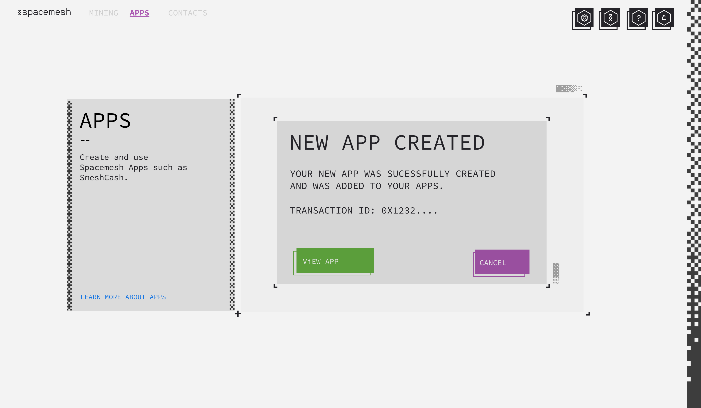

- Smapp displays this notification when the new smart wallet transaction was confirmed.
- User can click on `view app` to view his newly created smart wallet.

---

## Smart Wallet App Main Screen
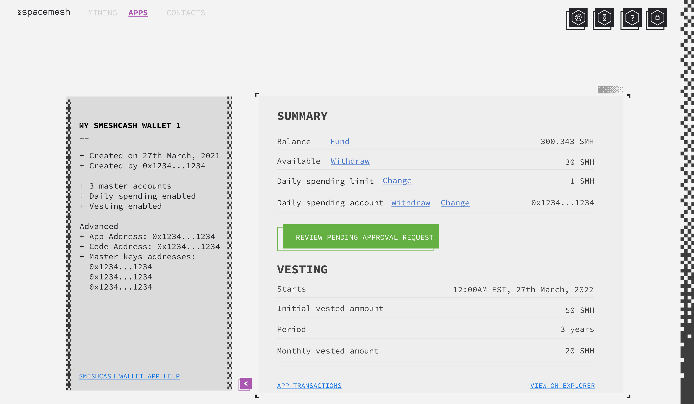
- This is the main smart wallet screen.
- The vesting section is only displayed if the wallet has the vesting feature enabled. For genesis, this is only going to be the case for genesis smart wallets and not for user-created smart wallets. User created smart wallets do not support setting vesting.
- On the left side user can see basic wallet info.
- The advanced section should be collapsed and click-able to be displayed to reduce information overload when looking at this screen. The mock shows the section expanded.
- The `review pending approval request` button should be displayed when is one or more pending approval request for the a 3 master accounts wallet that the user can sign with one of his wallet's account. There are 3 kind of approval operations:
1. a withdrawal request
2. a change to daily spending account
3. A change to daily spending wallet amount in a 3 mast

Clicking on the button should display the first pending operation for user approval (there can be more than 1 pending request - up to 1 per supported operation).

TODO: Add approve transaction screen here for each request.

---

## Smart Wallet Transactions Screen
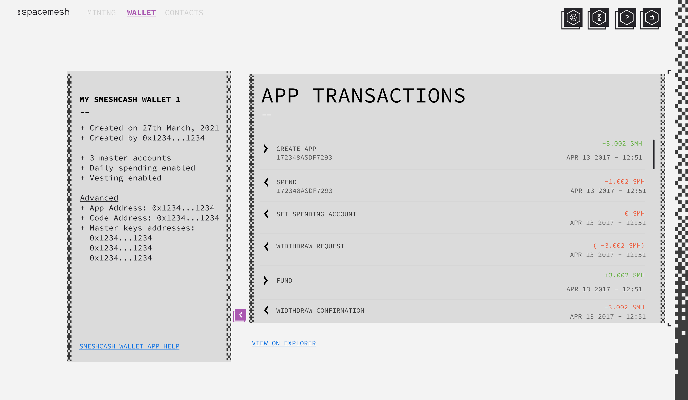

- This screen displays all transactions related to a smart wallet app. These include the app creation transaction and any transaction sent to the on-mesh app by any account (not just the accounts in the current active wallet).
- Link to `view on explorer` should open the explorer tab in smapp and display the app's transactions. The explore view should be more detailed as it is not limited to the data available to the local node or the API endpoint that smapp is connected to.
- The name of the operation of each transaction is displayed as well as any value associated with the transaction such as a withdrawal or funding.

---

## My Apps Screen
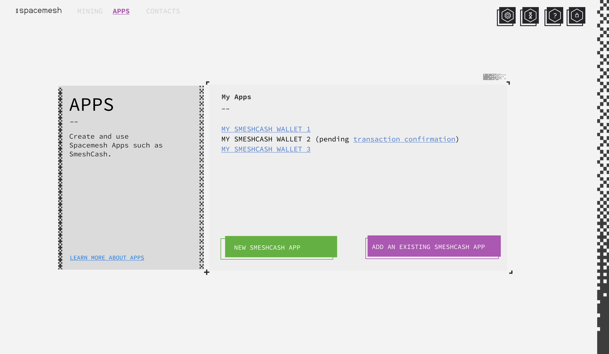

## Add an Existing Smart Wallet App
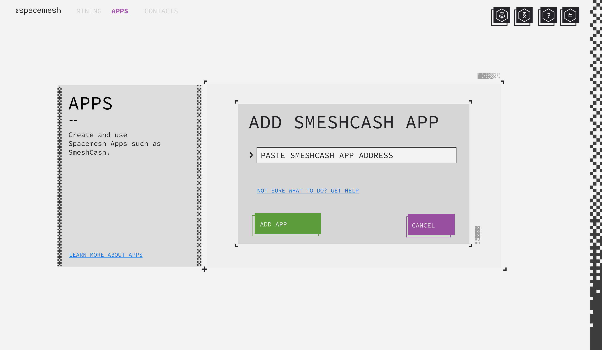

## Change Spending Account - 1 Master Account
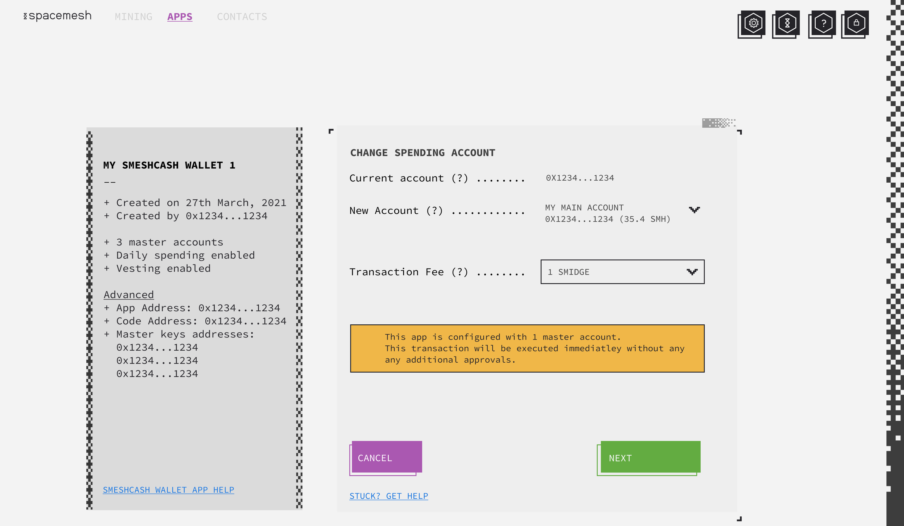

## Change Spending Account - 3 Master Accounts
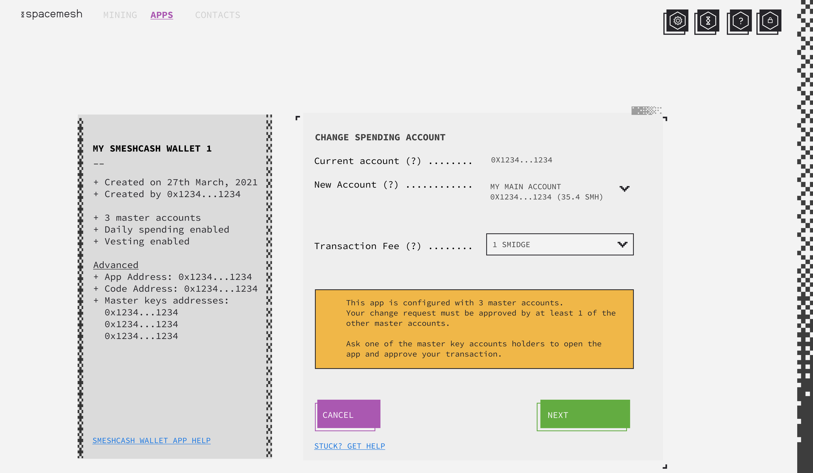

# Change Spending Amount - 1 Master Account
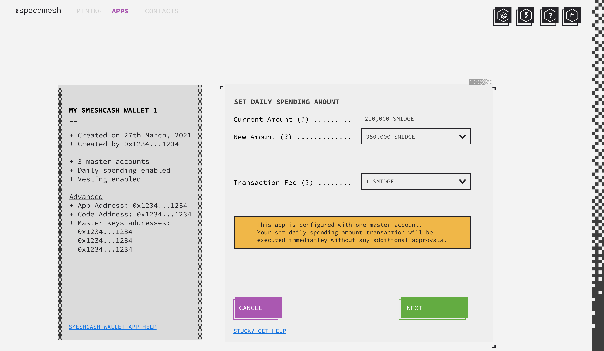

## Change Spending Amount - 3 Master Accounts
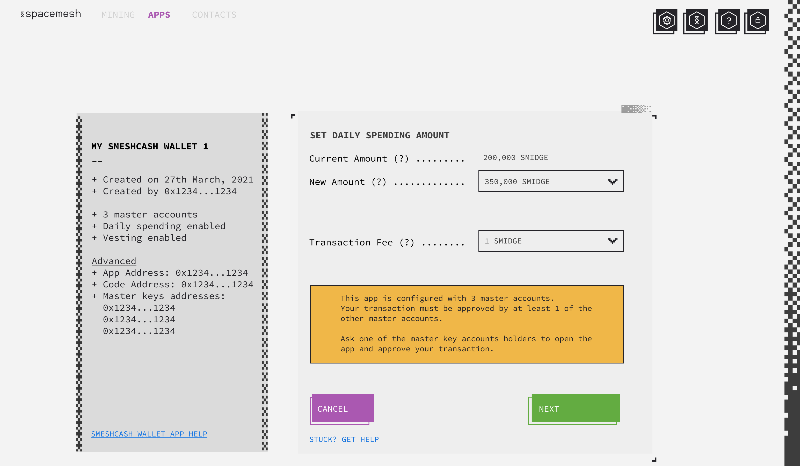

## Withdraw - 1 Master Account
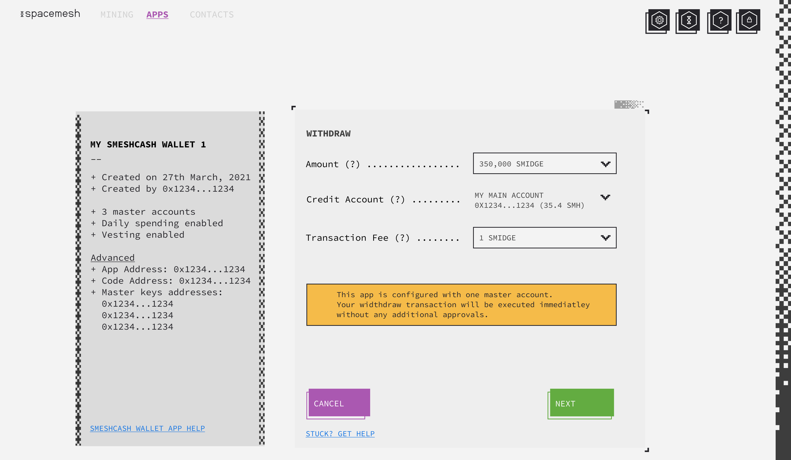

## Withdraw - 3 Master Accounts
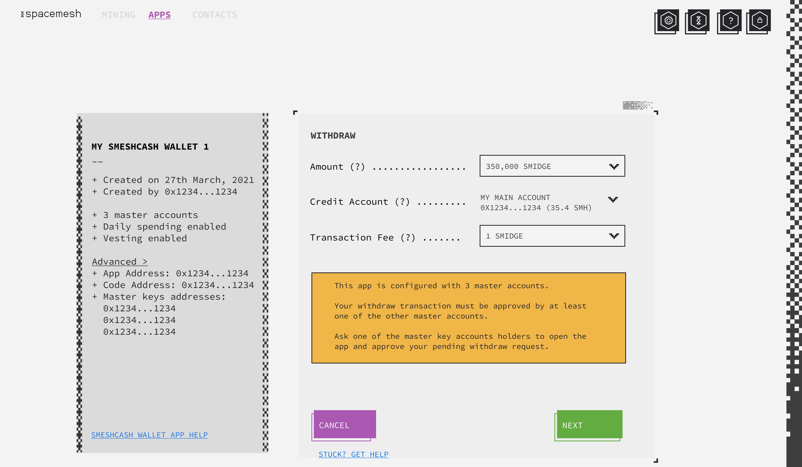
