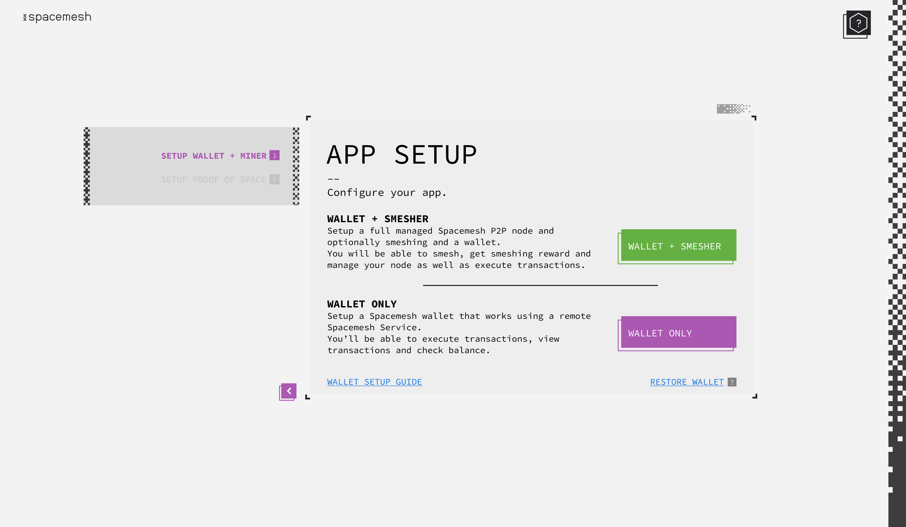
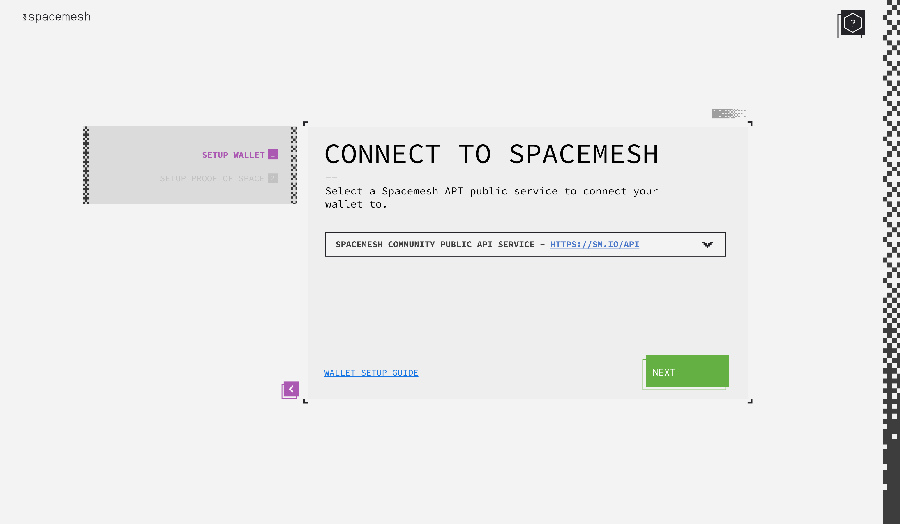
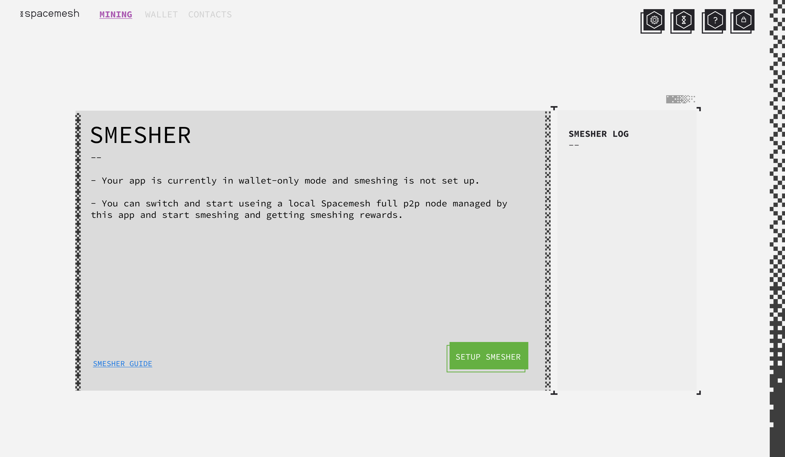

# Spacemesh App Design - Wallet Only Mode

## Motivation
1. We want to empower people who don't run a full node on their PC the ability to receive and send Spacemesh coin and to use vaults. This can significantly increase the user-base of Spacemesh open testnets as it allows these people to transact and experience the platform programability capabilities such as vaults. On mainnet, this widely broadens the reach of Spacemesh coin as a cryptocurrency as it empowers non-smeshers to use Spacemesh coin across a variety of use cases.
2. We want to allow users who run Spacemesh full node to use their Spacemesh wallets - check balance, transact and use vaults and ledger wallets from a computer which is not running a Spacemesh full node. In the future, this will extend from desktop to mobile devices.

## User Interactions and Mocks

### App Setup - Screen 1

The initial Spacemesh App setup process will display this screen as the first set up step. User can chose to run a full node managed by the App or to use the App in wallet only mode.

---

### App Setup - Screen 2

If the user chose `wallet only` in the first step then the next screen enables the user to choose a Spacemesh public API endpoint. Spacemesh will offer a community public API which provides services which enables full wallet functionality. e.g. Read account balance and count, view accounts transaction logs and submit a signed transaction to the network.

Additional public API endpoints may be provided by the community and will be available for selection in the screen after review by team spacemesh.

When user clicks 'NEXT' the interaction will skip the smeshing setup steps and go directly to the step where user chooses to create a new wallet or restore an existing one.

---

### Smesher Screen in Wallet Only Mode

---

### Switching Between App Modes
User need to be able to stop smesher and local full node and switch to wallet only mode at any time. User should be able to switch back to run a local full p2p node managed by the app from wallet only mode at any time.

> TODO: provide UI design for these features.
